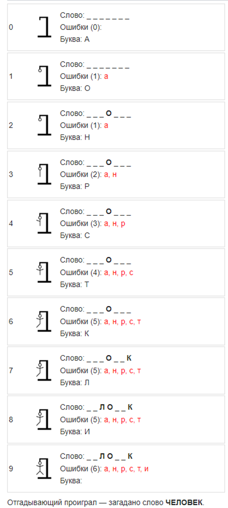

# Виселица (также известна как «Балда») 
реализация на Java, описание задания 
https://zhukovsd.github.io/java-backend-learning-course/Projects/Hangman/

Принцип игры
----------

Один из игроков загадывает слово — пишет на бумаге любые две буквы слова и отмечает места для остальных букв, например чертами (существует также вариант, когда изначально все буквы слова неизвестны). Также рисуется виселица с петлёй.

Согласно традиции русских лингвистических игр, слово должно быть именем существительным, нарицательным в именительном падеже единственного числа, либо множественного числа при отсутствии у слова формы единственного числа.

Второй игрок предлагает букву, которая может входить в это слово. Если такая буква есть в слове, то первый игрок пишет её над соответствующими этой букве чертами — столько раз, сколько она встречается в слове. Если такой буквы нет, то к виселице добавляется круг в петле, изображающий голову. Второй игрок продолжает отгадывать буквы до тех пор, пока не отгадает всё слово. За каждый неправильный ответ первый игрок добавляет одну часть туловища к виселице (обычно их 6: голова, туловище, 2 руки и 2 ноги, существует также вариант с 8 частями — добавляются ступни, а также самый длинный вариант, когда сначала за неотгаданную букву рисуются части самой виселицы).

Если туловище в виселице нарисовано полностью, то отгадывающий игрок проигрывает, считается повешенным. Если игроку удаётся угадать слово, он выигрывает и может загадывать слово.

Пример игры
--------

